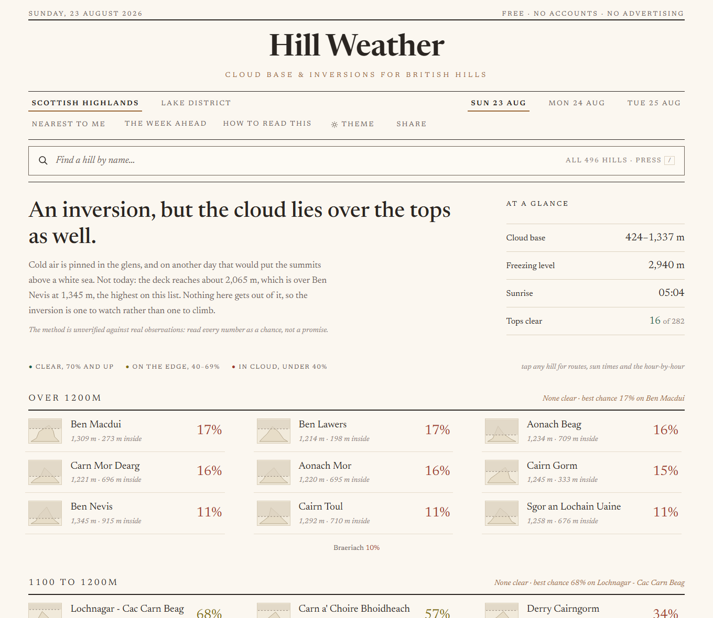
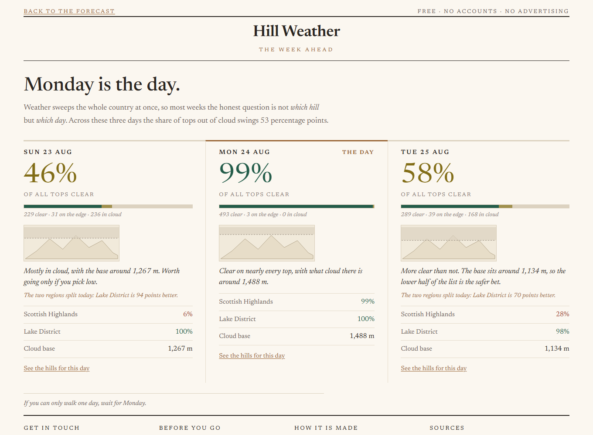
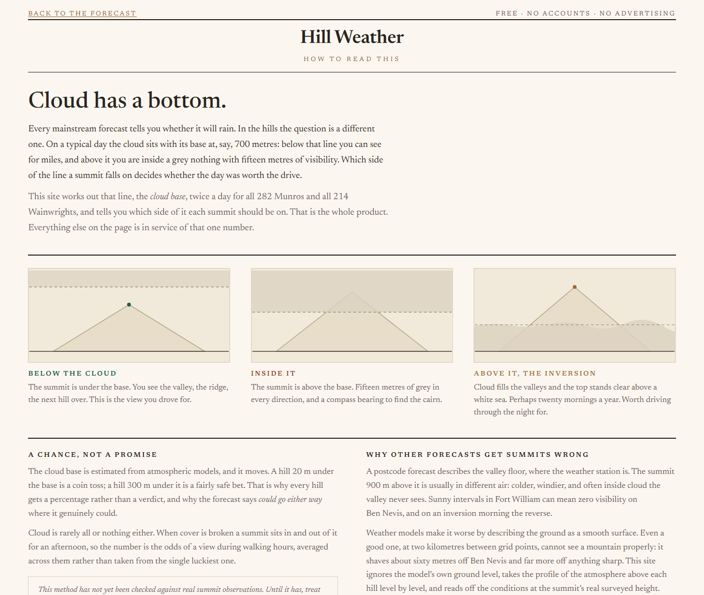
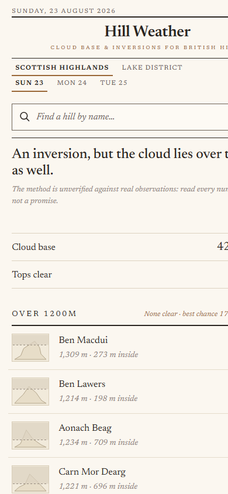
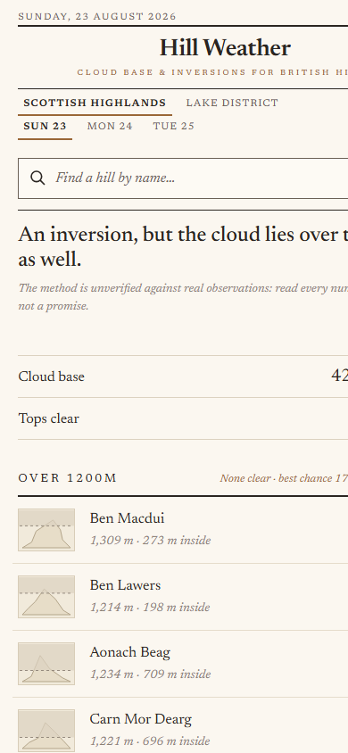

# Hill Weather

Cloud base and inversion forecasts for British hills. The one question no
mainstream weather app answers: **will I be in the cloud, above it, or clear?**

Live at **[hillweather.co.uk](https://hillweather.co.uk)**. Free,
non-commercial, no ads, no accounts. Covers all 282 Munros, all 214
Wainwrights and the 50 Hewitts of Snowdonia.

**Status: unvalidated.** The physics is defensible but has not yet been checked
against observations. See [Validation](#validation).

---

## What it looks like

The forecast opens with a paragraph written from the numbers rather than a wall
of percentages, then hills grouped by height band. Light and dark are the same
design inverted, not two designs.

| | |
|---|---|
|  |  |

**The week ahead**, which answers the question most weeks actually turn on:
not which hill, but which day.



**How to read this**, the explainer.



On a phone the lede trims to the headline and the at-a-glance figures, and the
hills go to one column.

<p>
  
  
</p>

Screenshots are of the live site and are regenerated with
`python scripts/screenshots.py`.

---

## Why it exists

Forecast models smooth terrain badly. A 2 km model shaves ~60 m off Ben Nevis;
a global 25 km model flattens the Highlands into a gentle bump. So when a
weather app shows "Ben Nevis, 8°C, light wind", it is describing a mountain
that does not exist.

This project takes the **pressure-level profile**: temperature, humidity, wind
and geopotential height at each level up through the atmosphere, and
interpolates it to the **true summit height**. From that, cloud base falls out,
and with it the three answers that matter:

- summit **in** cloud, so save your petrol
- summit **above** cloud, an inversion, the best day of the year
- **clear**

Nothing else publishes which hills are likely to be poking above a cloud sea
tomorrow morning.

## How it works

```
Open-Meteo (UK Met Office 2 km, pressure levels)
        |
        +--> archive.py   raw responses, gzipped, kept forever  -> archive/
        |                 ~40 validation hills, all 75 variables
        |
        +--> build.py     all 546 hills, minimal variables
                 |
                 +--> physics.py   cloud base, inversion, light scores
                 +--> solar.py     sunrise/sunset, golden hour, sun azimuth
                 +--> hills.py     DoBIH: heights, grid refs, lists, areas
                 +--> sources.json Wikipedia extracts, Walkhighlands links
                 |
                 v
            web/data/<region>/summary.json   ranked list, ~30 kB gzipped
            web/data/<region>/hills/*.json   full detail, fetched on tap
```

The site itself is three static pages plus one small service:

| | |
|---|---|
| `web/index.html` | The forecast. A lede written from the numbers, then hills grouped by height band. |
| `web/how-to-read.html` | What cloud base is, and why the number is a chance rather than a promise. |
| `web/contact.html` | Contact form. |
| `scripts/contact_server.py` | The only running service. A static site cannot send email. |

Two independent cloud-base estimates, cross-checked:

| Method | Good for | Limitation |
|---|---|---|
| **LCL**, lift a glen-level parcel, `125 x (T - Td)` | Orographic hill fog, which is most of what Scotland produces | Says where cloud *would* form, not that it exists, so it is gated on actual low-cloud cover |
| **RH profile**, lowest level crossing a moist threshold | Layer cloud, and finding the cloud *top* (which is what reveals inversions) | Model levels are 215-466 m apart; Munro summits sit in the widest gap |

Output is deliberately **probabilistic**. Broken cloud means the summit is in
and out of it, and saying so is more useful than a confident icon that is wrong.

## Running it

Python 3.9+, standard library only. No dependencies, no install step.

```bash
python scripts/hills.py                  # check the hill lists load
python scripts/archive.py                # collect a validation snapshot
python scripts/build.py                  # live build, all 546 hills (~8 min)
python scripts/archive.py --status       # how much history exists
```

Serve locally:

```bash
python -m http.server 8000 --directory web
```

Rebuild from an archived day instead of fetching. This is the backtest path,
and the reason the archive stores raw responses rather than derived answers:

```bash
python scripts/build.py --file archive/lakes/2026-08-22T08Z.json.gz
```

## Deployment

Two stock containers, no build step: `nginx:alpine` serving the files, and
`python:3.12-alpine` running the scheduler. The host needs Docker and nothing
else, not even Python.

```bash
git clone https://github.com/bartoszmilewski-engineeringsupport/hill-weather.git /opt/hillweather
```

```bash
cd /opt/hillweather/deploy && cp .env.example .env
```

```bash
cd /opt/hillweather/deploy && docker compose up -d
```

The scheduler builds immediately when no forecast is present, so a fresh host
is live within about ten minutes.

**Everything host-specific lives in `deploy/.env`**: paths, port, build times.
The schedule runs inside the stack rather than in host cron, so moving to a
different VPS or onto the homelab carries the schedule with it instead of
leaving it behind.

Builds run twice daily. Open-Meteo weights API calls by variable and location
count, so four builds a day would exceed the free tier.

Moving hosts:

```bash
cd deploy && ./migrate.sh export        # old host
```

```bash
cd deploy && ./migrate.sh import <file> && docker compose up -d && ./migrate.sh verify
```

The archive is the only irreplaceable state. Everything else is either in git
or rebuilds itself.

See [docs/RUNBOOK.md](docs/RUNBOOK.md) for DNS, proxy host, Cloudflare,
monitoring and routine operations.

## Validation

The honest state of the project. The maths is sound; whether it matches
reality is untested.

The plan: score archived forecasts against the Nevis Range, Cairngorm and
Glencoe webcams, and against the Lake District Fell Top Assessor reports,
a professional human observation from Helvellyn most winter days, which is far
better ground truth than a webcam.

**Target: cloud base right to within ~200 m on most days.** If it is not, no
amount of app polish saves this.

The constants to tune live at the top of `scripts/physics.py`: `RH_MOIST`,
`LOW_CLOUD_MIN`, `CLEAR_MARGIN`.

## Rules this project holds to

1. **Never scrape MWIS or Walkhighlands.** Their words are their own editorial
   work, and both are communities this project depends on. Link to them, never
   copy them. Wikipedia is the licensed source for prose, with attribution.
2. **Phones never call the weather API.** One build fetches, everyone reads the
   same static files. That is what keeps this inside the free tier at any scale.
3. **Not a general outdoors app.** No routes, no gear lists, no step counting;
   that road ends with a worse OS Maps.
4. **Be honest about uncertainty.** "Could go either way" is a feature.

## Attribution

- Weather: [Open-Meteo](https://open-meteo.com), UK Met Office 2 km
  deterministic model. CC-BY 4.0.
- Hills: [Database of British and Irish Hills](https://www.hill-bagging.co.uk/dobih)
  v18.5. CC-BY 4.0.
- Descriptions: [Wikipedia](https://en.wikipedia.org). CC BY-SA 4.0.
- Routes: [Walkhighlands](https://www.walkhighlands.co.uk), linked only.

Planning aid only, not a substitute for [MWIS](https://www.mwis.org.uk) or,
in winter, [SAIS](https://www.sais.gov.uk).
